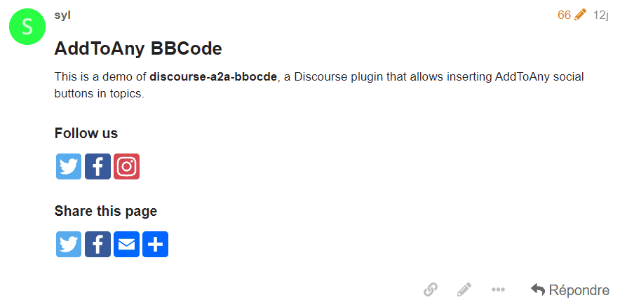

# discourse-a2a-bbocde

Discourse plugin to allow inserting [AddToAny](https://www.addtoany.com/) social buttons in topics.

Social buttons can be limited to some categories only by using the `discourse a2a bbcode categories` setting.

## Example

```
# AddToAny BBCode

This is a demo of **discourse-a2a-bbocde**, a Discourse plugin that allows inserting AddToAny social buttons in topics.

### Follow us
[abbfollow user=ProjCastafiore services=twitter,facebook,instagram][/abbfollow]

### Share this page
[abbshare services=twitter,facebook,email url=https://castafiore.org]I've discovered this amazing website![/abbshare]
```


